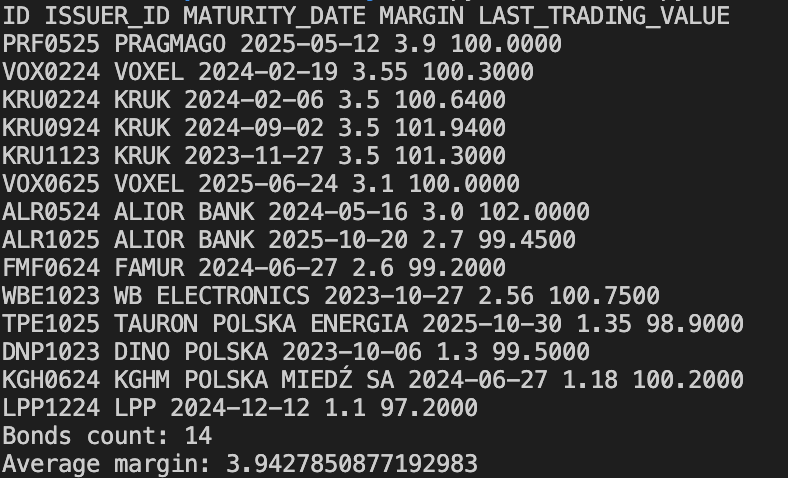

# pl-bonds-analyzer

## How to use
1. Download the latest version of this script
2. Download monthly statistics e.g (https://gpwcatalyst.pl/pub/CATALYST/statystyki/statystyki_miesieczne/202207_CAT.xls) and copy to ./data/dane.xls
3. Run the script
```python3 script.py```\
Expected result\


## Parameters
If needed you can change the parameters of the script.
- TRADING_VALUE_THRESHOLD - only active bonds trading value threshold, default 50k PLN
- NOMINAL_VALUE_THRESHOLD - default 1k PLN
- MARGIN_THRESHOLD_RELATIVE_TO_AVERAGE - risk threshold relative to average margin, default 0
- IS_FLOATING - include only floating bonds and not e.g. fixed bonds, default True
- MIN_MATURITY_YEARS - minimum maturity in years, default 1
- MAX_MATURITY_YEARS - maximum maturity in years, default 3

## Issuers exclude list
A list of issuers to exclude from the analysis, e.g. issuers with low liquidity, default couple of real estate issuers

## Reverse engineering
Get month state
https://gpwcatalyst.pl/pub/CATALYST/statystyki/statystyki_miesieczne/202207_CAT.xls

Get margin
curl -X POST https://obligacje.pl/ajax/kalkulatorDane.php -H "Content-Type: application/x-www-form-urlencoded" -d "dane=kal_kod_obligacji%3DCSA0726"